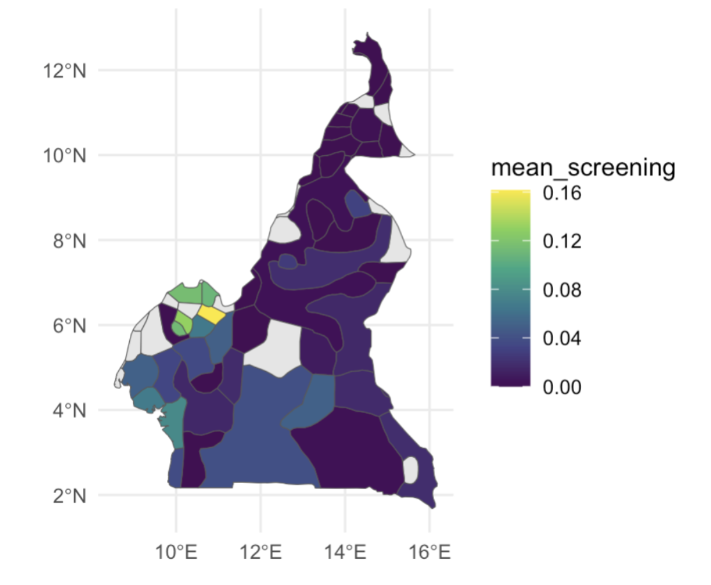
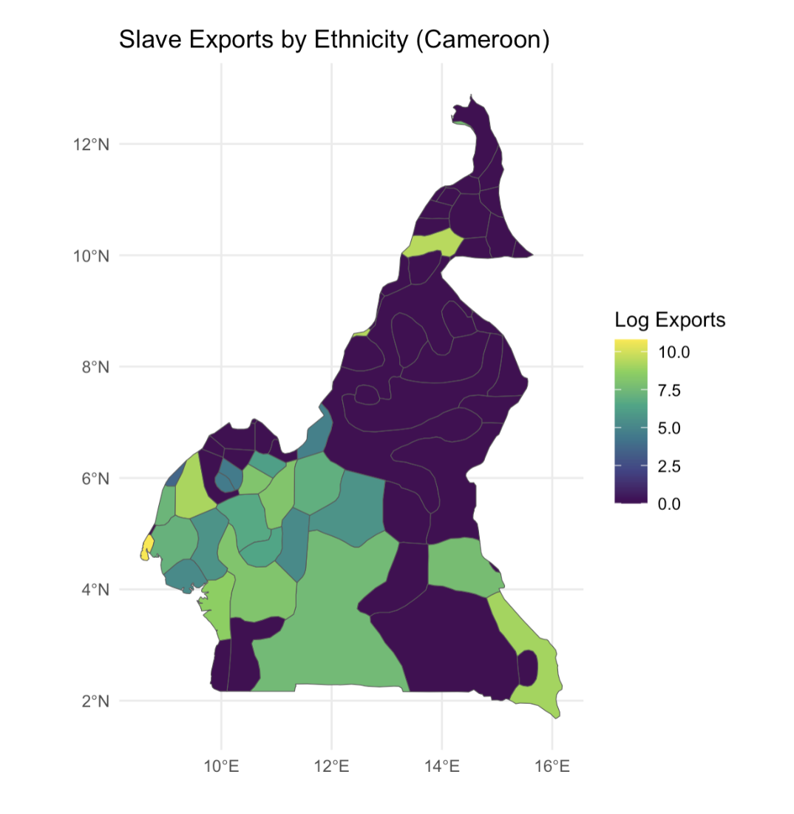
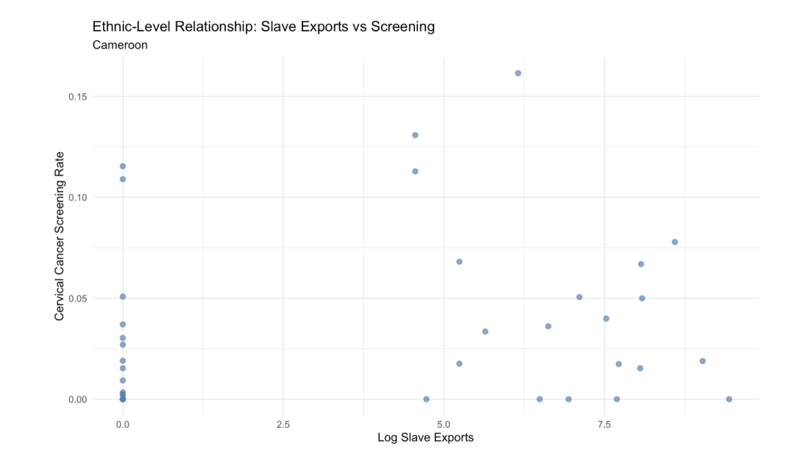
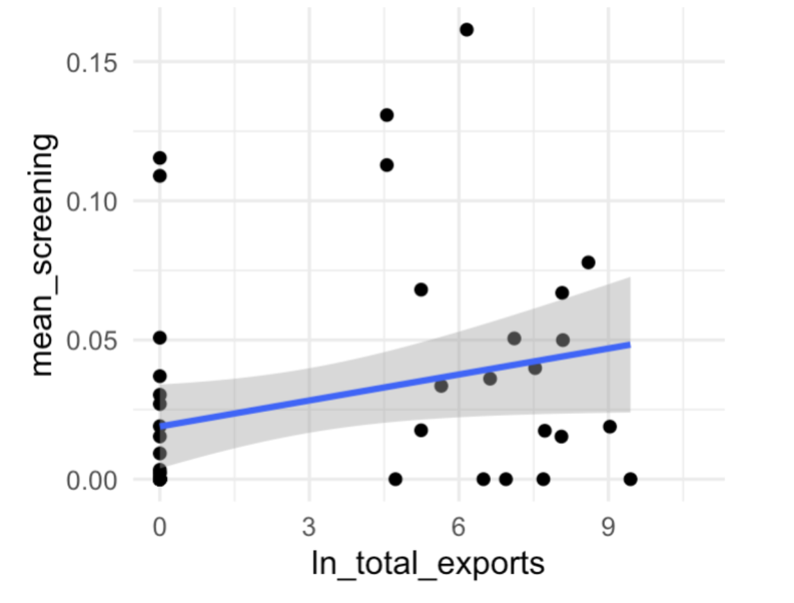

## 

1.  **Describe your research question and provide some background on why you find it interesting or important. Be sure to incorporate the feedback provided on the first assignment. Include references to at least two pieces of existing research that illustrate what has already been discovered about the relationship you are investigating. This could be articles published in academic journals, policy reports and white papers, articles published by think tanks and other credible organizations (ex. Brookings, the United Nations High Commissioner for Refugees, etc.), or pieces of data journalism. A full-credit response will probably be around 150-200 words. (40%)**

**Question:** Does historical exposure to extractive institutions, proxied by slave trade intensity, lead to weaker contemporary oncology infrastructure as measured by cancer screening rates?

This project seeks to investigate whether historical colonial extraction affects disparities in contemporary cancer infrastructure. In particular, the project examines whether African areas historically exposed to higher levels of slave trade extraction exhibit lower cancer screening rates. A large body of research demonstrates that extractive institutions established during the slave trades and colonial periods produced persistent economic and institutional consequences across modern Africa. [Nunn (2008)](https://academic.oup.com/qje/article/123/1/139/1889789) shows that regions more heavily exposed to the transatlantic and Indian Ocean slave trades experienced long-term economic decline and weaker institutional development due to violence, depopulation, and social fragmentation. Similarly, [Acemoglu, Johnson, and Robinson (2001)](https://www.aeaweb.org/articles?id=10.1257/aer.91.5.1369) argue that colonial powers frequently established extractive institutions designed to concentrate wealth away from citizens rather than develop inclusive governance systems, leaving durable effects on public service provision post-independence. These institutional weaknesses likely reduce state capacity to invest in public health systems, including preventative oncology services such as screening programs.

Complementing this institutional literature, global health research [(e.g., Lancet Oncology Commission)](https://www.thelancet.com/commissions-do/cancer-in-sub-saharan-africa) documents persistent deficits in cancer screening, diagnostic capacity, and workforce availability across sub-Saharan Africa. 

This project, therefore, tests whether long-run institutional legacies help explain observed disparities in oncology infrastructure across African regions.

2.  **State at least one testable hypothesis. Distill your research question into a statement about a specific relationship you expect to see in the world. In most cases, this hypothesis will describe a causal relationship between two variables (i.e. changes in x cause changes in y). Make an argument for why you expect to see this relationship. This should be based on related findings from existing research and/or your own theoretical/logical reasoning. A full-credit response will probably be around 150-200 words. (25%)**

Hypothesis: Communities located within historical ethnic homelands that experienced higher levels of slave trade extraction will exhibit lower contemporary cancer screening rates.

This hypothesis is grounded in literature linking historical extraction to long-run institutional and developmental outcomes. Nunn (2008) demonstrates that regions of Africa more heavily exposed to the slave trade experienced persistent economic decline and weaker institutional development. Moreover, [Michalopoulos and Papaioannou (2014)](https://academic.oup.com/qje/article/129/1/151/1897929?guestAccessKey=) further demonstrate that historical ethnic homelands remain meaningful units for analyzing contemporary outcomes in Africa, with institutional legacies continuing to shape subnational development.

These findings suggest two possible mechanisms. First, extractive historical processes weakened state capacity, limiting investment in public goods such as healthcare infrastructure. Preventive cancer screening programs require administrative coordination, medical infrastructure, and sustained public funding, all of which are constrained in institutionally weak regions. Second, historical extraction may reduce social and institutional trust, lowering engagement with formal healthcare providers.

Together, these mechanisms imply that regions more heavily exposed to historical colonial extraction will exhibit systematically lower cancer screening rates today.

3.  **Briefly discuss the specific variables you will use to test your hypothesis and the dataset they are drawn from. Be sure to mention the source of the data (the organization or individuals that produced it), the unit of analysis, and the sample. Create a ggplot to visualize the relationship between the variables being used to test your hypothesis. The best method of visualizing this relationship will depend on the scale of your variables. Good methods to consider are scatter plots (for continuous variables), grouped bar charts (for ordinal or binary variables), and line graphs (for continuous variables with time-series). (25%)**

To test the hypothesis, the analysis links historical slave trade exposure to contemporary cancer screening outcomes using spatially matched datasets. The project draws from Nathan Nunn’s Slave Trade Database, which estimates the number of individuals exported from Africa by ethnic groups during the transatlantic and Indian Ocean slave trades. The key independent variable is slave trade intensity, measured as the number of individuals exported from each ethnic group in Nunn (2008). This metric, demonstrating slave trade extraction by ethnic group, is merged with [Murdock’s Ethnic Homeland Shapefile](https://nathannunn.arts.ubc.ca/data/), which geolocates historical ethnic territories across Africa.

The dependent variable is cervical cancer screening rates, drawn from the Demographic and Health Surveys (DHS) program administered by USAID. DHS provides geocoded cluster-level data on women’s health behaviors, including whether respondents have received cervical cancer screening. The unit of analysis is the DHS survey cluster, representing local communities with observed screening outcomes and assigned historical exposure.

DHS cluster coordinates are spatially overlapped on the ethnic homeland polygons, obtained from the Murdock Shapefile, to assign each cluster the historical slave trade exposure of the ethnic group whose homeland contains it.

Because the dataset contains many clusters within each modern country, this empirical specification allows for the inclusion of country fixed effects, enabling the analysis to compare communities with different levels of historical slave trade exposure within the same national institutional environment. This helps isolate the relationship between historical extraction and contemporary screening outcomes while controlling for country-level factors such as national health policy, economic development, or institutional quality.

The resulting dataset includes cluster-level screening rates and historical extraction intensity.

Please note: Due to constraints in manually identifying and extracting relevant variables across multiple national DHS datasets, this analysis is currently implemented as a proof of concept using data from Cameroon. The attached figures include (1) a spatial mapping of cervical cancer screening rates by geolocated ethnicity, (2) a mapping of slave trade intensity by geolocated ethnicity, and (3) a scatter plot illustrating the relationship between slave trade exposure and cervical cancer screening rates across ethnic groups within Cameroon.

The spatial maps and scatterplot provide preliminary visual evidence of substantial heterogeneity across ethnic regions, motivating the regression analysis.

\(1\)

\(2\)

\(3\)

**Next Steps: Scaling the Analysis**

To move beyond the current Cameroon-based proof of concept, the next phase of this project will focus on constructing a unified, multi-country dataset that enables systematic cross-country analysis. The final data set will be the result of extracting DHS cluster-level GPS coordinates and corresponding cervical cancer screening metrics. Although this step is time-intensive due to the fragmented structure of DHS files and manual variable identification, it is necessary to create a consistent, geolocated dataset of screening outcomes.

These DHS clusters will then be spatially matched to ethnic homelands using the Murdock shapefile and linked to slave trade exposure from the Nunn dataset. This will produce a single, integrated dataset at the cluster level, allowing for a comparable analysis across countries, enabling stronger statistical inference than that of isolated country-level models.

4.  **Specify the main regression model you will use to test your hypothesis. This regression model should provide a preliminary test for or against the validity of your hypothesis. Use markdown to render the equation neatly to the html file. (10%)**

$$
\text{Screening}_{c} = \beta_0 + \beta_1 \ln(\text{SlaveExports}_{c}) + \beta_2 \text{Age}_{c} + \beta_3 \text{Urban}_{c} + \gamma_{k} + \varepsilon_{c}
$$

-   **Screening_c**

Cervical cancer screening rate in DHS cluster c, constructed from DHS individual-level responses.

-   

-   **SlaveExports_e** 

Slave trade intensity for ethnic group e, assigned to cluster c via spatial overlap with the Murdock Ethnic Homeland Shapefile and drawn from Nunn (2008).

-   **Age_c**

Average age of women in cluster c, controlling for variation in screening likelihood across age groups.

-   **Urban_c**

Indicator for whether cluster c is classified as urban, capturing differences in healthcare access between urban and rural areas.

-   **γ_k** 

Represents country fixed effects, which control for national-level characteristics such as health policy, economic development, and institutional quality. As multiple DHS clusters exist within each country, this specification allows the analysis to compare communities with different levels of historical slave trade exposure within the same national environment.

-   **β_1** 

Captures whether higher historical extraction intensity is associated with lower contemporary screening rates.

The coefficient β_1 captures the relationship between historical slave trade intensity and contemporary cervical cancer screening rates. A negative and statistically significant β_1 would provide evidence consistent with the hypothesis that greater historical extraction is associated with weaker modern oncology infrastructure, even after controlling for demographic composition (age), urbanization, and country-level factors.\
\
\
The slave exports metric was logged as the raw slave export variable is highly skewed and non-linear in its relationship with outcomes.

**Table 01. Linear Regression of Cervical Cancer Screening Rates on Log Slave Exports.**

|                  |          |            |         |         |              |
|------------------|----------|------------|---------|---------|--------------|
| Variable         | Estimate | Std. Error | t value | p-value | Significance |
| Intercept        | 0.01894  | 0.00748    | 2.532   | 0.0149  | \*           |
| ln_total_exports | 0.00311  | 0.00163    | 1.908   | 0.0627  | .            |

The estimated coefficient on log slave exports is positive (β₁ = 0.0031) and marginally statistically significant at the 10% level (p = 0.063). This finding runs counter to the hypothesis that higher historical extraction leads to weaker contemporary oncology infrastructure. One possible explanation is that this result reflects noise due to the limited sample (Cameroon only) or unobserved confounding factors. The small magnitude of the coefficient and low explanatory power (R² = 0.075) further suggest that this relationship is weak and should be interpreted cautiously.
