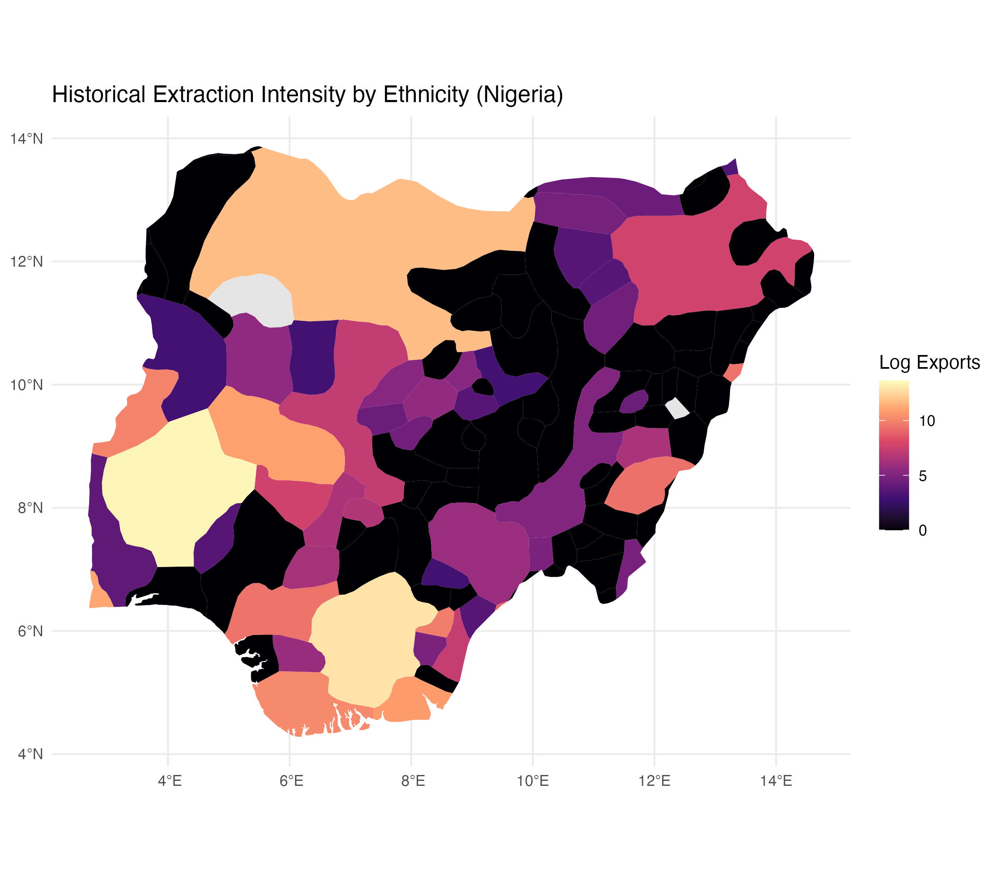
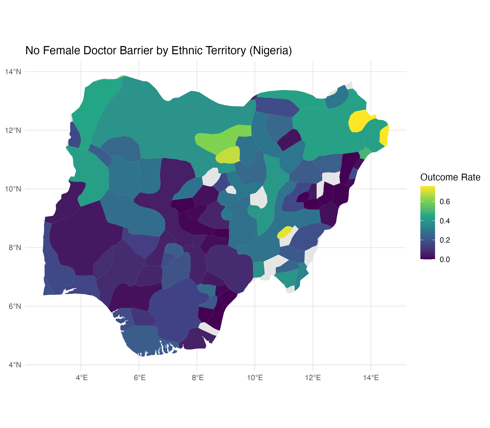
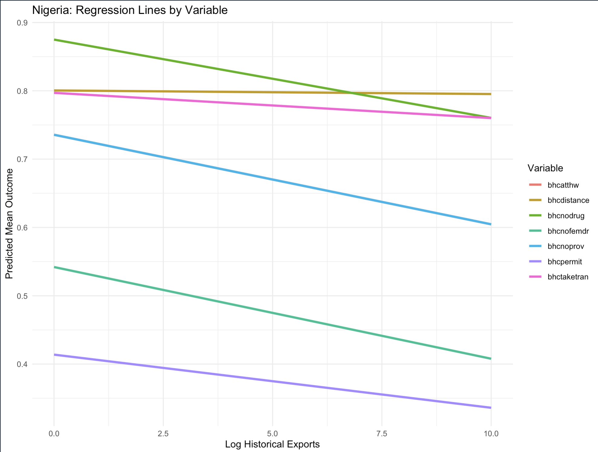
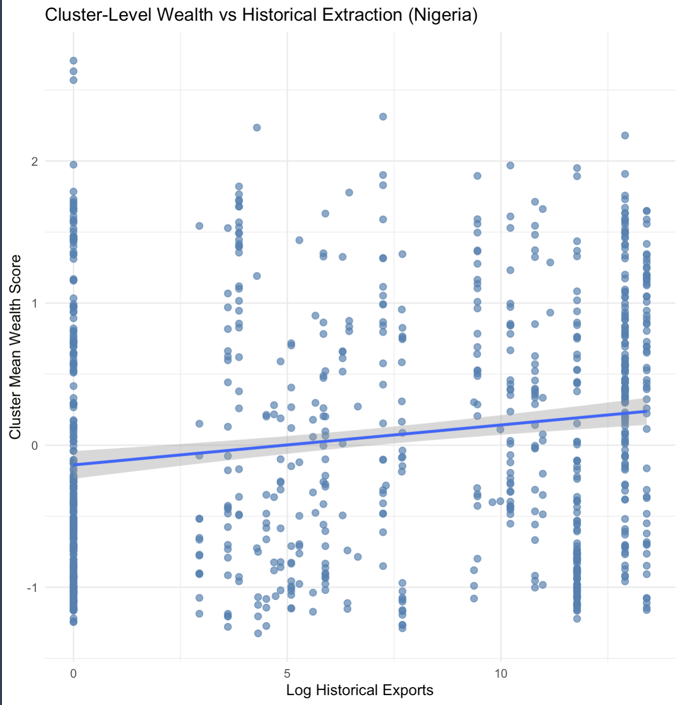
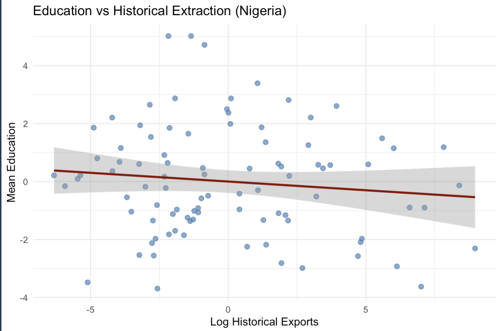

Author: Serafeim Nikolaos Kaznessis

Mentor: Dr. Carolina Torreblana (PSCI 3200)

Date: May 10 2026

## Introduction

How does historical extraction shape contemporary access to healthcare? A body of political economy research posits that colonial extraction produced durable patterns of underdevelopment across Sub-Saharan Africa. Nathanal Nunn’s landmark study of Africa’s slave trades finds that countries from which more enslaved people were exported tend to have lower levels of contemporary economic development, which suggests that extraction weekend institutions and disrupted long-run growth trajectories [@nunn2008]. Similarly, Acemoglu, Johnson, and Robinson argue that European powers established extractive institutions in regions where high settler mortality discouraged permanent settlement, creating states designed to transfer wealth outward rather than build inclusive public institutions [@acemoglu2001]. In this literature, extraction is generally understood to be a destructive historical force whose effects continue to shape present-day development.

Yet the relationship between extraction and development may be more complicated at the sub-national level. Country-level analysis often treats colonial legacies as if they affected the entire nation uniformly. This assumption is particularly problematic in Africa, where colonial states were often spatially uneven, with borders failing to accurately represent societal and economic borders [@michalopoulos2016; @michalopoulos2020]. Michalopoulos and Papaionnou explain how variation in African development is linked to local ethnic, geographic, and historical factors, especially in areas from capitals and administrative centers [@michalopoulos2014]. Their work suggests that the effect of colonial history may not operate only through national institutions but also through localized patterns of state presence, trade access, infrastructure, and social organization [@michalopoulos2014; @michalopoulos2020].

This project builds from that sub-national perspective while directly engaging a tension in the existing literature. If extraction generally damages institutional development, we might expect historically extracted regions to consistently face worse contemporary developmental outcomes, which applies to healthcare that demands complex structure implementation. However, the relationship between extraction and contemporary outcomes remains complex and convoluted by many competing factors.

The regions targeted for extraction were not necessarily random: European engagement in Africa often began in communities that were geographically accessible and already connected to regional trade networks. Nunn notes that slave exports were frequently concentrated in more densely populated societies, which suggests that extraction was partly selective toward areas with greater preexisting development [@nunn2008]. As Acemoglu, Johnson, and Robinson argue, Europeans in high mortality environments too, tended to establish extractive institutions designed to transfer labor and resources abroad rather than build inclusive systems of governance [@acemoglu2001]. The consequences of this process were profoundly destructive: slave raiding and coercive extraction disrupted social organization, weakened local institutions, and all in all reduced long-run development potential [@nunn2008]. Yet, extractions' effect on modern-day development is nonlinear. On the other hand, the same communities that were initially targeted were also those most visible and accessible to colonial actors, making them more likely to receive later missionary activity, transportation infrastructure, administrative outputs , and commercial investment. Michalopoulos and Papaioannou’s conception of the African “gatekeeper state” emphasizes how colonial governments concentrated authority and resources in strategically important locations linked to trade and state control [@michalopoulos2020]. This historical sequence suggests two competing mechanisms: extraction may have undermined local development through violence and institutional destruction, but the communities most exposed to extraction may also have become more deeply integrated into colonial and post-colonial systems of infrastructure, markets, service provision,and public goods allocation. Whether historically extracted areas exhibit worse or better contemporary healthcare access is therefore an empirical question rather than a foregone conclusion.

Along with it being a highly relevant variable to analyze from a social welfare perspective, healthcare access is a particularly useful outcome for investigating the relationship between extraction and development, as it captures both public institutional capacity and household-level ability to navigate services. Barriers such as cost, distance, lack of providers, lack of drugs, transportation difficulty, and permission constraints reflect not only whether healthcare systems exist, but also whether people can realistically use them given their colonial history.

This paper examines the relationship between historical extraction and contemporary healthcare barriers using sub-national cluster-level data from three countries with differing colonial pasts: Nigeria, Cameroon, and Zambia. The piece links ethnic homeland measures of historical slave exports to contemporary DHS cluster-level measurements of self-reported healthcare access barriers. By comparing patterns across countries, this project seeks to understand whether extraction has a consistent relationship with healthcare access or whether its legacy varies depending on country-specific colonial histories and infrastructure development.

The primary contribution of this project is to test a canonical historical development argument as it relates to healthcare at a more local scale. Rather than assuming that extraction uniformly predicts weaker development, this analysis investigates whether the relationship differs not only across national contexts but also across regions at the ethnic-homeland level, and across types of health care barriers. In doing so, it does not treats colonial extraction as a single and uniform legacy, but as a specific process whose effects may depend on where extraction occurred, how colonial states governed those regions,and whether extractive contexts later translated into infrastructure, administrative presence, or persistent exclusion.

## Theory and Hypothesis

The dominant expectation in the historical development literature is that colonial extraction should worsen contemporary healthcare access [@nunn2008; @acemoglu2001]. If, as current theory posits, extraction weakened institutions, disrupted local social organization, reduced trust, and redirected resources away from public goods, then communities historically exposed to higher levels of extraction should face greater difficulty accessing healthcare today [@nunn2008; @acemoglu2001]. Under this canonical framework, extraction should be associated with weaker state capacity, fewer public services, lower levels of institutional trust, and, thus, higher barriers to care.

Along with being an interesting variable to analyze due to global health policy implications, healthcare access is a particularly useful outcome for testing this expectation because it reflects not only the presence of public infrastructure but the ability of households to navigate that infrastructure, and thus parsing its relationships with colonial extraction may tease out the effects of extractions on contemporary interaction with modernized systems at the community level. If extractive institutions produced persistent underdevelopment, then historically extracted regions should be more likely to report barriers such as cost, distance, lack of drugs, lack of providers, transportation difficulty, permission constraints, and fear of visiting healthcare providers alone.

However, this expectation becomes less straightforward at the sub-national level. Country-level theories often emphasize how extraction shaped national institutions, but they can obscure the fact that colonial rule operated unevenly within countries [@michalopoulos2014; @michalopoulos2020]. The African colonial state was not equally present everywhere. It often governed through concentrated administrative centers, trade corridors, missionary networks, ports, and transport routes [@michalopoulos2020]. As a result, the true micro-level consequences of extraction may depend on whether historically extracted regions were later incorporated into colonial and post-colonial systems of infrastructure and service provision.

This creates the central theoretical tension of the project. On one hand, extraction may have damaged national institutions and produced long-run social fragmentation, disrupting trade, transportation, and developmental prosperity generally, etc. On the other hand, the places most exposed to extraction were often not randomly selected [@nunn2008]. They were frequently communities with greater population density, geographic accessibility, political organization, or integration into preexisting trade networks. These characteristics made them more visible to European traders, missionaries, and administrators. Therefore, even if the extraction itself was destructive, historically extracted regions may also have become more connected to later colonial infrastructure, administrative activity, and commercial development, leading to greater exposure to contemporary systems and a higher understanding of how to interact with these systems.

The ethnic homeland scale is important because it allows this project to examine extraction below the national level, where broad country-level factors such as colonizer identity, national institutional quality, civil war history, and post-colonial regime type are less able to fully explain variation [@michalopoulos2014]. Furthermore, the ethnic homeland scale allows for differing behavioral patterns and traditions to be kept constant. By linking historical extraction to ethnic homelands and then to DHS clusters, this analysis focuses on local historical exposure rather than treating each country as a single unit. This does not eliminate all confounding, but it allows the project to examine whether communities with different extraction histories within the same country also differ in reported healthcare access.

The theoretical expectation is therefore not that extraction has one universal effect across all African contexts. Instead, extraction may produce competing legacies. A destructive legacy would predict higher healthcare barriers through institutional breakdown, poverty, mistrust, and weaker public goods provision [@nunn2008; @acemoglu2001]. An incorporation legacy would predict lower healthcare barriers if historically extracted regions were also those more likely to become connected to trade routes, administrative centers, missionary hospitals, schools, roads, and later state services [@michalopoulos2020]. Which legacy dominates may vary by country depending on colonial administration, geography, post-colonial infrastructure, and the structure of the local economy [@michalopoulos2016; @michalopoulos2020].

This framework, all in all, leads to the project's primary hypothesis:

**H1: Higher historical extraction is associated with lower reported healthcare access barriers at the sub-national level when extraction is linked to persistent local economic, administrative, or infrastructural incorporation.**

This hypothesis is intentionally in tension with the canonical expectation. It predicts that, within some countries, areas with higher historical extraction may report fewer barriers to healthcare access today. This would be inconsistent with a simple interpretation that extraction uniformly produces worse local outcomes. The hypothesis would be falsified if higher extraction is associated with higher reported barriers, or if there is no systematic relationship between extraction and healthcare access.

The mechanism underlying this hypothesis is that historically extracted regions may have become more connected to colonial and postcolonial systems of service provision. These regions may have had greater exposure to administrative institutions, roads, trade corridors, schools, missionary activity, and healthcare facilities. This does not mean extraction was beneficial. Rather, it means that the historical geography of extraction may overlap with the historical geography of incorporation into state and market systems. In this sense, extraction may proxy not only for exploitation, but also for early contact with external networks that later shaped access to public services.

**Extraction → Localized Economic Advantage → Higher Household Wealth → Lower Reported Barriers**

A second hypothesis addresses cross-country variation:

**H2: The relationship between historical extraction and healthcare barriers varies across countries because colonial administration, infrastructure investment, and post-colonial state formation differed across national contexts.**

This hypothesis predicts that the extraction-healthcare relationship should not look identical in Nigeria, Cameroon, and Zambia. In one country, extraction may remain associated with lower barriers even after controlling for urbanization and wealth, suggesting a persistent local institutional or infrastructural legacy. In another, the relationship may weaken once urbanization and wealth are included, suggesting that contemporary development explains more of the association. In a third, the relationship may be null or inconsistent, suggesting that extraction did not produce a durable local access pattern. This variation is best explained simply by the complex nature of extraction's contemporary effects as an event that radically changes the foundation of communities affected. Depending on colonizer and extraction intensity, it is logical that the relationship, both magnitude and clarity, will differ between colonial contexts [@michalopoulos2016; @michalopoulos2020]. Thus, while this project analyzes at the ethnic level, it does so by analyzing ethnicities within the same country to hold constant colonization, colonial history, civil war, etc. [@michalopoulos2014].

Together, these hypotheses refine the broader research question into a testable empirical claim: historical extraction may shape contemporary healthcare access, but its effects are conditional rather than uniform. The project therefore, tests not only whether extraction predicts healthcare barriers, but also whether that relationship changes across countries and across different dimensions of healthcare access.

## Research Design

This project uses a comparative sub-national research design to test whether historical extraction is associated with contemporary healthcare access barriers in Nigeria, Cameroon, and Zambia. The historical extraction data come from Nathan Nunn’s ethnic homeland-level estimates of slave exports, which measure the volume of slaves exported during the four major slave trades (Trans-Atlantic, Indian Ocean, Red Sea, and Trans-Saharan) between 1400 and 1900, mapping historical extraction records to Murdock’s ethnographic map. These data are linked to contemporary survey data from the Demographic and Health Surveys (DHS), which provide geographically referenced information on household characteristics and self-reported healthcare access barriers. Using the Murdock ethnic homeland map, I spatially assign DHS observations to ethnic homelands following the subnational mapping strategy associated with Michalopoulos and Papaioannou’s work on African development. Individual DHS responses are first aggregated to the DHS cluster level, then joined to Murdock ethnic homelands and aggregated again to the ethnic homeland level. As a result, the final unit of analysis is the ethnic homeland. This is appropriate for the research design because the primary independent variable, historical slave exports, is measured at the ethnic homeland level, allowing contemporary healthcare access outcomes to be compared across historically distinct local communities.

#### **Figure 1:** Historical Extraction Intensity by Ethnic Homeland in Nigeria

*This map shows logged historical slave exports by ethnic homeland. Lighter areas indicate higher historical extraction intensity, while darker areas indicate lower or no recorded extraction.*

#### **Figure 2:** No Female Doctor Barrier by Ethnic Homeland in Nigeria

*This map shows the average share of respondents within each ethnic homeland who report lack of a female doctor as a barrier to healthcare access. Darker areas indicate lower reported barriers, while lighter areas indicate higher reported barriers.*

The sample includes DHS clusters from Nigeria, Cameroon, and Zambia for survey years in which the relevant healthcare access variables are available: Nigeria in 2008, Cameroon in 2004, and Zambia in 2013. This country selection allows the analysis to test whether the relationship between historical extraction and healthcare barriers is consistent across national contexts or varies by colonial and post-colonial history.

Nigeria serves as the primary case because it has substantial within-country variation in historical extraction, a relatively coherent British colonial administrative history, and a large DHS sample due to its high population. Cameroon and Zambia provide comparison cases with different colonial and economic histories: Cameroon’s German, French, and British colonial experience creates a more layered administrative legacy, while Zambia’s more mining-centered colonial economy offers a contrast to the heavy slave-export extraction experienced in Nigeria [@michalopoulos2020].

The main independent variable is ln_total_exports, the natural logarithm of total slave exports associated with each cluster’s assigned ethnic homeland. This variable operationalizes historical extraction. The dependent variables are DHS measures of self-reported healthcare access barriers, including cost, distance to facility, transportation difficulty, lack of providers, lack of drugs, lack of female doctors, needing permission to seek care, and not wanting to go to healthcare appointments alone. These variables map onto the theoretical concept of healthcare access because they capture practical, financial, geographic, and social constraints that shape whether individuals can realistically obtain care.

#### **Table 1. Summary Statistics for Main Variables by Country**

| Country | Variable | Description | Mean | SD | Min | Max |
|-----------|-----------|-----------|----------:|----------:|----------:|----------:|
| Nigeria | `ln_total_exports` | Logged historical slave exports by ethnic homeland | 2.847 | 3.853 | 0.000 | 13.659 |
| Nigeria | `bhcnodrug` | Lack of medicine barrier | 0.474 | 0.223 | 0.000 | 0.902 |
| Nigeria | `bhcnoprov` | Lack of provider barrier | 0.376 | 0.210 | 0.011 | 0.816 |
| Nigeria | `bhcnofemdr` | Lack of female doctor barrier | 0.200 | 0.175 | 0.000 | 0.758 |
| Nigeria | `bhcdistance` | Distance barrier to healthcare | 0.442 | 0.231 | 0.032 | 1.000 |
| Nigeria | `bhcpermit` | Permission barrier | 0.166 | 0.120 | 0.000 | 0.500 |
| Nigeria | `bhctaketran` | Transportation barrier | 0.427 | 0.235 | 0.011 | 1.000 |
| Nigeria | `bhcalone` | Not wanting to go alone barrier | 0.251 | 0.180 | 0.012 | 0.855 |
| Cameroon | `ln_total_exports` | Logged historical slave exports by ethnic homeland | 2.855 | 3.623 | 0.000 | 10.796 |
| Cameroon | `bhcdistance` | Distance barrier to healthcare | 0.434 | 0.235 | 0.000 | 1.000 |
| Cameroon | `bhcmoney` | Cost barrier to healthcare | 0.704 | 0.148 | 0.364 | 1.000 |
| Cameroon | `bhcpermit` | Permission barrier | 0.157 | 0.135 | 0.000 | 0.500 |
| Cameroon | `bhctaketran` | Transportation barrier | 0.417 | 0.233 | 0.000 | 1.000 |
| Cameroon | `bhcalone` | Not wanting to go alone barrier | 0.288 | 0.190 | 0.031 | 0.900 |
| Zambia | `ln_total_exports` | Logged historical slave exports by ethnic homeland | 2.466 | 3.647 | 0.000 | 10.796 |
| Zambia | `bhcatthw` | Bad attitude of healthcare worker barrier | 0.327 | 0.136 | 0.000 | 9.4528 |
| Zambia | `bhcnodrug` | Lack of medicine barrier | 0.407 | 0.136 | 0.067 | 0.704 |
| Zambia | `bhcnoprov` | Lack of provider barrier | 0.284 | 0.137 | 0.000 | 0.556 |
| Zambia | `bhcnofemdr` | Lack of female doctor barrier | 0.109 | 0.070 | 0.000 | 0.407 |
| Zambia | `bhcdistance` | Distance barrier to healthcare | 0.366 | 0.157 | 0.000 | 0.857 |
| Zambia | `bhcpermit` | Permission barrier | 0.031 | 0.036 | 0.000 | 0.222 |
| Zambia | `bhctaketran` | Transportation barrier | 0.349 | 0.144 | 0.000 | 0.810 |
| Zambia | `bhcalone` | Not wanting to go alone barrier | 0.169 | 0.086 | 0.000 | 0.432 |

The main control variables are mean_wealth and mean_urban. Mean wealth captures average household wealth within each cluster and is included because economic resources affect the ability to pay for treatment, travel to facilities, and navigate health systems. Mean urbanization captures the share of households in a cluster classified as urban and is included because urban areas generally have greater provider density, shorter distances to facilities, stronger transportation networks, and more concentrated public services. Furthermore, urbanization was chosen as a primary control as it silences the gatekeeper state differentiation created from raw transportation and trade routes, allowing the isolation of mechanisms directly linking extraction to outcomes. A summary statistics table reports the mean, standard deviation, minimum, and maximum for ln_total_exports, the healthcare barrier outcomes, mean_wealth, and mean_urban.

The main regression model is:

$$
\text{Barrier}_e = \beta_0 + \beta_1 \ln(\text{Extraction}_e) + \beta_2 \text{Wealth}_e + \beta_3 \text{Urban}_e + \epsilon_e
$$

The secondary regression models are:

$$
\text{Barrier}_e = \beta_0 + \beta_1 \ln(\text{Extraction}_e) + \epsilon_e
$$

$$
\text{Barrier}_e = \beta_0 + \beta_1 \ln(\text{Extraction}_e) + \beta_2 \text{Urban}_e + \epsilon_e
$$

Here, Barrierₑ is the average probability that respondents in ethnic homeland e report a specific healthcare barrier, ln(Extractionₑ) is logged slave exports for ethnic homeland e, Wealthₑ is mean wealth among DHS respondents in ethnic homeland e, and Urbanₑ is the share of DHS respondents or clusters in ethnic homeland e classified as urban. The coefficient of interest is β₁, which estimates the relationship between historical extraction and contemporary healthcare access after conditioning on wealth and urbanization.

In addition to the main model, I estimate two mechanism-oriented models. First, I control only for urbanization to test whether the extraction-healthcare relationship is simply explained by historically extracted regions being more urban today, and whether the effect of gatekeeper states leading to differentiations in contemporary access is isolated to a greater ability to urbanize. Second, I examine whether extraction predicts contemporary cluster-level wealth, including a version that holds urbanization constant. This tests the first link in the proposed mechanism: extraction may be associated with higher contemporary wealth if historically extracted areas were also incorporated into trade routes, administrative centers, missionary networks, transportation corridors, or commercial activity.

The main limitation of this design is that it identifies conditional correlations rather than definitive causal effects. Historical extraction may be correlated with geography, including proximity to coasts, rivers, trade routes, and colonial administrative centers. Other unobserved confounders, such as missionary presence, colonial infrastructure placement, conflict history, ecological conditions, disease environments, or population sorting, may also affect both extraction and healthcare access. As an empirical extension, I examine the relationship between historical extraction and mean cluster-level education. This extension tests whether extraction is simply capturing a broader pattern of development, or whether its relationship is more specific to healthcare access barriers. If extraction predicts education in the same way that it predicts healthcare access, then the healthcare findings may reflect a general development gradient as it relates to extraction history rather than a healthcare-specific mechanism. If the relationship weakens after accounting for urbanization and then both urbanization and wealth, this would suggest that the healthcare results should not be generalized too broadly to all developmental outcomes, and suggests that they can be analyzed for the unique relationship that extraction may possess with contemporary healthcare access. A second empirical extension examines the relationship between extraction and wealth at the sub-national level, since a positive association would provide additional support for the proposed mechanism that extraction may contribute to lower healthcare barriers through contemporary economic advantage.

## Findings

#### **Figure 3: Nigeria Main Regression: Relationship Between Historical Extraction (ln_total_exports) and Mean Healthcare Outcome**

*Figure 1 displays a negative relationship between extraction and reported healthcare barriers, consistent with the regression results. Clusters with higher historical exposure to extraction tend to report fewer constraints to accessing healthcare. This pattern is consistent with the proposed mechanism of localized economic persistence, whereby historically advantageous regions exhibit higher wealth and improved ability to navigate healthcare constraints.*

Across the three countries, the relationship between historical extraction and contemporary healthcare barriers is generally negative, but the strength and persistence of this relationship vary substantially by country. Figure 1 visualizes the relationship between ln_total_exports and the reported healthcare barrier in Nigeria after controlling for urbanity and wealth. Overall, the plotted relationship suggests that clusters with higher historical exposure to extraction tend to report fewer barriers to healthcare access. Furthermore, the plot displays how particularly variables that relate to healthcare intrinsic aspects (eg. bhcnodrug, bhcnofemdrl bhcpermit) exhibit a more negative relationship than those variables that may have to do with more general transportation development (eg. bhcdistance and bhctaketran). This pattern supports the project’s core hypothesis that extraction does not uniformly predict worse local access outcomes. Instead, at the sub-national level, extraction may also capture historical incorporation into trade routes, administrative centers, infrastructure, and service networks, signaling how extraction set up gatekeeper state infrastructure design.

The regression results provide the clearest support for this pattern in Nigeria. In the uncontrolled models, the coefficients on ln_total_exports are negative for all healthcare barriers. After controlling for both wealth and urbanization, several outcomes remain negative and statistically significant, including lack of drugs, lack of providers, lack of female doctors, and needing permission to seek care. 

#### Table 2. Nigeria Regression Models Controlling for Urbanization and Wealth

| Predictor | `bhcatthw` | `bhcnodrug` | `bhcnoprov` | `bhcnofemdr` | `bhcdistance` | `bhcpermit` | `bhctaketran` | `bhcalone` |
|--------|-------:|-------:|-------:|-------:|-------:|-------:|-------:|-------:|
| `ln_total_exports` | -0.0005 | -0.0115\* | -0.0131\* | -0.0134\* | -0.0005 | -0.0078\* | -0.0037 | -0.0018 |
|  | (0.0048) | (0.0054) | (0.0057) | (0.0060) | (0.0048) | (0.0034) | (0.0048) | (0.0029) |
| `mean_urban` | 0.0385 | -0.0630 | -0.0550 | 0.0093 | 0.0385 | 0.0171 | 0.1004 | 0.0417 |
| `mean_wealth` | -0.1303 | -0.1143 | -0.0973 | -0.0902 | -0.1303 | -0.0709 | -0.1443 | -0.0701 |
| p-value for `ln_total_exports` | 0.9130 | 0.0380 | 0.0234 | 0.0278 | 0.9130 | 0.0239 | 0.4480 | 0.5260 |
| Urbanization control | Yes | Yes | Yes | Yes | Yes | Yes | Yes | Yes |
| Wealth control | Yes | Yes | Yes | Yes | Yes | Yes | Yes | Yes |

: Nigeria Regression Models Controlling for Urbanization and Wealth

*Note:* Entries report OLS coefficients from regressions of ethnic-homeland healthcare barrier outcomes on logged historical slave exports, controlling for mean cluster-level urbanization and wealth. Standard errors for `ln_total_exports` are reported in parentheses. Significance markers: `*` p \< 0.05.

The magnitude of these effects is modest but substantively meaningful: a one-unit increase in logged slave exports is associated with roughly a 0.8 to 1.3 percentage-point decrease in reported barriers for several outcomes. Importantly, these effects are strongest for service-related barriers rather than physical access barriers. Distance and transportation remain negative but are not statistically significant, suggesting that extraction is not simply associated with easier geographic access, but with a more specific service or institutional access environment. Furthermore, the dampening of effects after controlling for urbanization and wealth suggest that a mechanism for extractions relationship to contemporary health care barriers may exist in these factors.

The urbanization-only models further strengthen this interpretation. In Nigeria, controlling only for urbanization makes several extraction coefficients more negative and statistically significant. This suggests that the extraction-healthcare relationship is not reducible to the fact that historically extracted regions may be more urban today. Rather, extraction appears to capture a longer-run institutional or infrastructural legacy beyond raw urban concentration alone. This result raises the possibility that extraction’s legacy extends beyond the spatial logic of the gatekeeper state and may instead reflect deeper, longer-run changes in local institutional development, social organization, and patterns of access to public goods.

Cameroon and Zambia show weaker and less consistent patterns. In Cameroon, several coefficients are negative before controls, but the relationship weakens once wealth and urbanization are included. In Zambia, the coefficients are mixed, small, and largely insignificant. This cross-country variation suggests that historical extraction’s relationship to healthcare access is conditional rather than universal, and it calls for future investigation into patterns between sub-Saharan nations.

#### Table 3. **Historical Extraction Coefficients Across Countries and Model Specifications**

| Country | Variable | No Controls β | No Controls p | Urban Only β | Urban Only p | Urban + Wealth β | Urban + Wealth p |
|---------|--------:|--------:|--------:|--------:|--------:|--------:|--------:|
| Nigeria | bhcdistance | -0.0011 | 0.8499 | -0.0025 | 0.6560 | -0.0005 | 0.9130 |
| Nigeria | bhcnodrug | -0.0111\* | 0.0851 | -0.0132\*\* | 0.0306 | -0.0115\*\* | 0.0380 |
| Nigeria | bhcnofemdr | -0.0137\*\* | 0.0346 | -0.0148\*\* | 0.0212 | -0.0134\*\* | 0.0278 |
| Nigeria | bhcnoprov | -0.0128\*\* | 0.0458 | -0.0146\*\* | 0.0183 | -0.0131\*\* | 0.0234 |
| Nigeria | bhcpermit | -0.0081\*\* | 0.0368 | -0.0089\*\* | 0.0198 | -0.0078\*\* | 0.0239 |
| Nigeria | bhctaketran | -0.0048 | 0.4194 | -0.0059 | 0.3170 | -0.0037 | 0.4480 |
| Nigeria | bhcalone | -0.0023 | 0.4870 | -0.0029 | 0.3790 | -0.0018 | 0.5260 |
| Cameroon | bhcdist | -0.0133 | 0.1644 | -0.0044 | 0.6050 | 0.0004 | 0.9595 |
| Cameroon | bhcmoney | -0.0150\*\* | 0.0108 | -0.0078\* | 0.0773 | -0.0045 | 0.2812 |
| Cameroon | bhcpermit | -0.0132\*\* | 0.0143 | -0.0098\* | 0.0604 | -0.0081 | 0.1320 |
| Cameroon | bhctaketran | -0.0114 | 0.2288 | -0.0032 | 0.7120 | 0.0017 | 0.8488 |
| Cameroon | bhcalone | -0.0153\*\* | 0.0455 | -0.0111 | 0.1420 | -0.0075 | 0.3307 |
| Zambia | bhcdistance | -0.2804 | 0.7810 | -0.0083 | 0.1070 | -0.0099\* | 0.0661 |
| Zambia | bhcnodrug | 0.0031 | 0.5720 | 0.0015 | 0.7780 | 0.0004\* | 0.0657 |
| Zambia | bhcnofemdr | 0.0040 | 0.1250 | 0.0035 | 0.1780 | 0.0035 | 0.2148 |
| Zambia | bhcnoprov | 0.0045 | 0.3880 | 0.0036 | 0.4920 | -0.0002 | 0.9652 |
| Zambia | bhcpermit | 0.0006 | 0.7080 | 0.0001 | 0.9380 | 0.0014 | 0.3666 |
| Zambia | bhctaketran | -0.3499 | 0.7290 | -0.0089\* | 0.0860 | -0.0102\* | 0.0646 |
| Zambia | bhcalone | 0.0121 | 0.6810 | -0.0009 | 0.7990 | -0.0025 | 0.4592 |

*Note:* \*\*\* p \< 0.01, \*\* p \< 0.05, \* p \< 0.10.

*Note:* Entries report the coefficient on `ln_total_exports`. The “Urban Only” model controls for `mean_urban`. The “Urban + Wealth” model controls for both `mean_urban` and `mean_wealth`. Significance markers follow the regression output: `.` p \< 0.10, `*` p \< 0.05, `**` p \< 0.01.

Nigeria provides the strongest evidence of a persistent extraction-healthcare relationship, while Cameroon and Zambia suggest that colonial administration, infrastructure patterns, and post-colonial state formation may determine whether extraction translates into contemporary access advantages or disadvantages.

## Empirical Extension: Wealth and Education as Developmental Comparisons

To test whether the healthcare findings reflect a broader developmental pattern or a more healthcare-specific relationship, I examine two related extensions: the relationship between historical extraction and contemporary cluster-level wealth, and the relationship between historical extraction and mean cluster-level education. These tests help clarify whether extraction is simply capturing general development or whether healthcare access has a distinct relationship with historical extraction.

First, I estimate the direct relationship between ln_total_exports and mean cluster-level wealth. This test evaluates the first link in the proposed mechanism: extraction may be associated with higher contemporary wealth if historically extracted regions were also more likely to be incorporated into trade routes, administrative centers, missionary networks, transportation corridors, or commercial activity. The results show a positive and statistically significant relationship. A one-unit increase in logged slave exports is associated with a 0.028 increase in ethnic-level wealth, with a p-value below 0.001. This supports the possibility that historically extracted regions became more economically incorporated over time rather than uniformly disadvantaged, positing that extraction’s relation to contemporary healthcare access may very well act via increased wealth.

#### **Figure 4: Relationship Between Historical Extraction (ln_total_exports) and Mean Cluster-Level Wealth**

*Figure 2 plots the relationship between historical colonial extraction (ln_total_exports) and mean cluster-level wealth, showing a positive and statistically significant association where higher extraction is correlated with higher contemporary wealth.*

#### **Table 4. Effect of Colonial Extraction on Cluster-Level Wealth (Nigeria DHS Clusters)**

|  |  |  |  |  |  |
|------------|------------|------------|------------|------------|------------|
| **Variable** | **Coefficient (β)** | **Std. Error** | **t-value** | **p-value** | **Significance** |
| Intercept | -0.138897 | 0.049586 | -2.801 | 0.00521 | \*\* |
| ln_total_exports | 0.028124 | 0.005785 | 4.862 | 1.38E-06 | \*\*\* |

I then use mean cluster-level education as a developmental comparison outcome. In the no-control model, extraction is positively and significantly associated with education: a one-unit increase in logged slave exports corresponds to a 0.209-year increase in mean education. After controlling only for urbanization, this coefficient falls to 0.156 and becomes only marginally significant. Once both urbanization and wealth are included, the coefficient reverses direction to -0.060 and is no longer statistically significant. Meanwhile, wealth remains strongly significant, suggesting that contemporary household wealth explains much more of the variation in education than extraction itself. While this may be explained by a similar mechanism to that one proposed for health care access, that is, extraction leading to higher wealth and higher wealth leading to higher education, this differs from healthcare’s outcome. First, after controlling for both urbanity and wealth, several variables remain significantly negative in healthcare, including lack of drugs, lack of providers, lack of female doctors, and needing permission to seek care. This suggests that extraction’s relationship to healthcare access is not fully explained by contemporary wealth or urban concentration. Second, when controlling only for urbanity, the negative extraction-healthcare relationship becomes more pronounced than in the uncontrolled or fully controlled models. This suggests that extraction is not merely proxying for urban development, but may capture a longer-run institutional or access-related legacy. Compared to education, where the extraction effect weakens after controls, healthcare appears to have a more distinct relationship with extraction.

#### **Figure 5: Relationship Between Historical Extraction (ln_total_exports) and Mean Education Level (Controlling for Urbanity and Wealth)**

*Figure 3 plots mean years of education against historical extraction and shows no statistically significant relationship, supporting the placebo test that extraction does not generally predict human capital outcomes once wealth is controlled for.*

#### **Table 5: Placebo Test - Effect of Colonial Extraction on Education (Nigeria DHS Clusters)** 

| Model | Extraction Coefficient | Extraction p-value | Urban Coefficient | Urban p-value | Wealth Coefficient | Wealth p-value | R² |
|---------|--------:|--------:|--------:|--------:|--------:|--------:|--------:|
| No controls | 0.2094\* | 0.0146 | — | — | — | — | 0.0638 |
| Urban control only | 0.1556. | 0.0607 | 4.1298\*\* | 0.0020 | — | — | 0.1589 |
| Urban + wealth controls | -0.0601 | 0.2900 | -1.0687 | 0.2680 | 3.0220\*\*\* | \<0.001 | 0.6506 |

*Note:* Entries report coefficients from regressions of mean cluster-level education on `ln_total_exports`. The urban control model includes `mean_urban`; the full model includes both `mean_urban` and `mean_wealth`. Significance markers: `.` p \< 0.10, `*` p \< 0.05, `**` p \< 0.01, `***` p \< 0.001.

Together, these extensions refine the interpretation of the healthcare findings. The wealth regression supports the proposed mechanism by showing that extraction is positively associated with contemporary wealth. However, the education comparison suggests that extraction is not simply capturing a universal developmental advantage. Instead, the persistent relationship between extraction and healthcare barriers may reflect a more specific access-related pathway involving service environments, institutional presence, infrastructure, or household ability to navigate care.

## Discussion and Policy Implications: Toward a Heterogeneous Understanding of Extraction’s Legacy

This project shows that historical extraction does not have a uniform relationship with contemporary healthcare access. While the canonical literature would predict that higher extraction should produce greater barriers to care, the results suggest a more complicated sub-national pattern [@nunn2008; @acemoglu2001]. In Nigeria, historical extraction is relatively consistently associated with lower reported healthcare barriers, particularly for service-related outcomes such as lack of drugs, lack of providers, lack of female doctors, and needing permission to seek care. Cameroon and Zambia, however, show weaker and less consistent relationships, suggesting that extraction’s legacy depends heavily on country-specific colonial and post-colonial histories [@michalopoulos2016; @michalopoulos2020].

These results provide suggestive evidence in favor of the hypothesis, but they are not fully conclusive. Due to the complex and convoluted contemporary effect of extraction history, the analysis identifies conditional correlations rather than definitive causal effects. Historical extraction may be correlated with geography, missionary presence, colonial infrastructure placement, trade routes, conflict history, disease environments, or migration patterns. Any of these factors could shape both where extraction occurred and how healthcare access developed over time. Therefore, the findings should be interpreted as evidence of a meaningful historical pattern, not proof that extraction directly caused lower healthcare barriers.

The central implication is that extraction should not be treated as a single, uniformly destructive legacy across all places and outcomes. Extraction may have damaged communities, but the regions most exposed to it may also have been more visible to colonial states, missionaries, trade networks, and infrastructure projects [@michalopoulos2020]. Healthcare access may therefore reflect a specific pathway of historical incorporation rather than general development alone.

Although this project uses general healthcare access barriers, its original motivation was oncology access. This distinction matters because cancer care requires specialized infrastructure, including diagnostics, pathology, chemotherapy, radiotherapy, trained providers, and referral networks. If historically extracted regions show fewer general healthcare barriers, they may also be more likely to overlap with areas of stronger specialized care infrastructure. However, oncology access may be even more unequal because it depends on highly centralized services. Future research should directly test this by linking historical extraction to oncology-specific measures such as radiotherapy unit locations, cancer screening rates, oncology workforce density, and treatment availability, or attempt to identify a proxy that can particularly tease out a community's current capacity for oncology care.

For policy, the key lesson is not that historically extracted regions were advantaged in a normative sense, but rather, the historical geography of extraction may have produced uneven access: some communities became incorporated into infrastructure and service networks, while others remained peripheral [@michalopoulos2014; @michalopoulos2020]. Contemporary health policy should therefore prioritize lower-wealth, lower-access hinterland communities that were bypassed by colonial and post-colonial infrastructure. Future research could strengthen this analysis by adding direct measures of roads, hospitals, missionary presence, colonial administrative centers, and conflict exposure to better isolate the mechanisms linking extraction to healthcare access.

\
